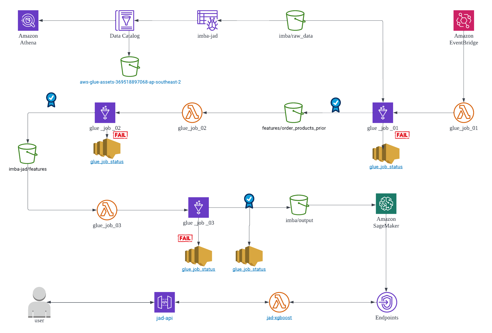

### Introduction of Project
#### 1.Background
Instacart is a grocery order and delivery app, which is similar to Coles or Woolworth order and delivery app in Australia. Over 3 million grocery orders from more than 200, 000 customers were provided by Instacart as open-sourced data. However, the salesman of Instacart recommends products in traditional ways or, that is to say, manually. They have not made good use of the huge amount of valuable transactional records yet. By taking advantage to analyse an ample amount of data, Instacart would predict well customer purchasing behaviour and pattern, which would strongly enhance their competitiveness.

#### 2.Purpose
This project intends to build an automated big data pipeline to process data and to build a machine learning model for predicting products that a user will buy again, try for the first time or add to cart next during a session.

#### 3.Data
The dataset is provided as-is for non-commercial use, and can be downloaded from S3 at: https://www.instacart.com/datasets/grocery-shopping-2017 and is subject to Instacart Terms and Conditions.

#### 4.Plan
This project builds a data lake in AWS S3, uses AWS services such as Glue Crawler, Athena and DataBrew to process data, then integrates and builds data ETL process in Glue Job, and trains machine learning models in AWS SageMaker.

#### 5.Techniques
- Data Modelling: Relational Model
- AWS services: S3, Glue Crawler, Athena, Glue studio, Glue DataBrew, Lambda, EventBridge, SageMaker, API Gateway
- Infrustracture as Code: AWS CloudFormation
- Version Control: Git, GitHub
- CICD: GitHub Action
- Big Data Processing: PySpark in Glue
- Machine Learning Modelling: XGBoost 

#### 6.Data Modelling

#### 7.Data Pipeline
